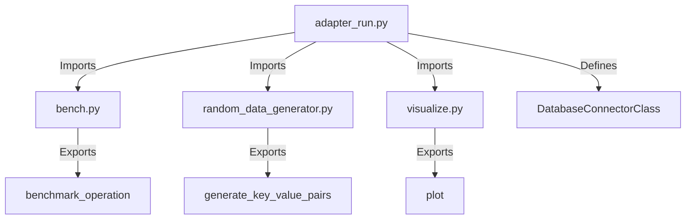
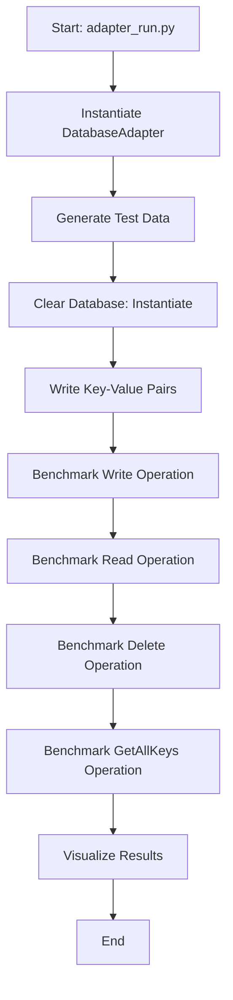
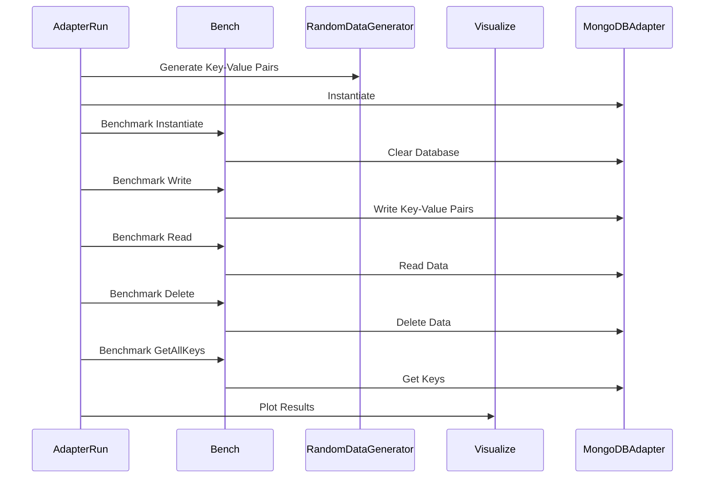
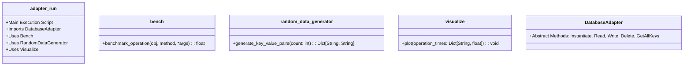

### 1) Dependecy graph

```mermaid
graph TD
    A[adapter_run.py] -->|Imports| B[bench.py]
    B -->|Exports| C[benchmark_operation]
    
    A -->|Imports| D[random_data_generator.py]
    D -->|Exports| E[generate_key_value_pairs]
    
    A -->|Imports| F[visualize.py]
    F -->|Exports| G[plot]
    
    A -->|Defines| H[DatabaseConnectorClass]
```

### 2) Flow diagram

```mermaid
flowchart TD
    A[Start: adapter_run.py] --> B[Instantiate DatabaseAdapter]
    B --> C[Generate Test Data]
    C --> D[Clear Database: Instantiate]
    D --> E[Write Key-Value Pairs]
    E --> F[Benchmark Write Operation]
    F --> G[Benchmark Read Operation]
    G --> H[Benchmark Delete Operation]
    H --> I[Benchmark GetAllKeys Operation]
    I --> J[Visualize Results]
    J --> K[End]
```

### 3) Sequence Diagram

```mermaid
sequenceDiagram
    participant AdapterRun
    participant Bench
    participant RandomDataGenerator
    participant Visualize
    participant MongoDBAdapter

    AdapterRun->>RandomDataGenerator: Generate Key-Value Pairs
    AdapterRun->>MongoDBAdapter: Instantiate
    AdapterRun->>Bench: Benchmark Instantiate
    Bench->>MongoDBAdapter: Clear Database
    
    AdapterRun->>Bench: Benchmark Write
    Bench->>MongoDBAdapter: Write Key-Value Pairs
    
    AdapterRun->>Bench: Benchmark Read
    Bench->>MongoDBAdapter: Read Data
    
    AdapterRun->>Bench: Benchmark Delete
    Bench->>MongoDBAdapter: Delete Data
    
    AdapterRun->>Bench: Benchmark GetAllKeys
    Bench->>MongoDBAdapter: Get Keys
    
    AdapterRun->>Visualize: Plot Results
```

### 4) Class Diagram

```mermaid
classDiagram
    class adapter_run {
        +Main Execution Script
        +Imports DatabaseAdapter
        +Uses Bench
        +Uses RandomDataGenerator
        +Uses Visualize
    }

    class bench {
        +benchmark_operation(obj, method, *args): float
    }

    class random_data_generator {
        +generate_key_value_pairs(count: int): Dict[String, String]
    }

    class visualize {
        +plot(operation_times: Dict[String, float]): void
    }

    class DatabaseAdapter {
        +Abstract Methods: Instantiate, Read, Write, Delete, GetAllKeys
    }

    adapter_run
```